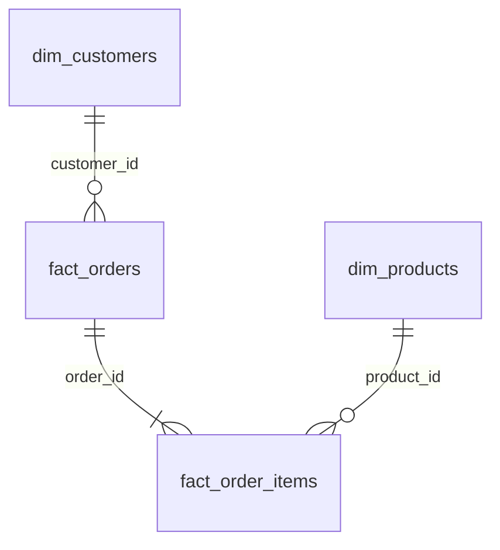

# Power BI & Tableau Implementation Blueprint

This blueprint provides the exact formulas, schemas, and visual configurations needed to replicate this dashboard inside **Power BI Desktop** or **Tableau Desktop / Tableau Public**.

---

## 1. Data Model & Schema Design (Star Schema)

When importing the CSVs from `data/raw/` into Power BI or Tableau, configure relationships as follows:



* **`fact_orders`**: Granularity is 1 row per order transaction.
* **`fact_order_items`**: Granularity is 1 row per line item.
* **`dim_customers`**: Granularity is 1 row per unique customer.
* **`dim_products`**: Granularity is 1 row per unique SKU/product.

> [!TIP]
> Alternatively, for a quick single-table build, simply import the pre-joined `data/processed/ecommerce_analytics_master.csv`.

---

## 2. Power BI DAX Formulas (Copy-Paste Ready)

Create a dedicated measure table called `_Measures` and add the following DAX calculations:

### Core Financial & Performance Measures
```dax
Total Sales = 
SUM(fact_orders[total_amount])

Total Gross Profit = 
SUM(fact_orders[gross_profit])

Gross Margin % = 
DIVIDE([Total Gross Profit], [Total Sales], 0)

Total Completed Orders = 
CALCULATE(
    COUNTROWS(fact_orders),
    fact_orders[order_status] = "Completed"
)

Average Order Value (AOV) = 
DIVIDE([Total Sales], [Total Completed Orders], 0)
```

### Time Intelligence Measures
```dax
Sales Prior Year = 
CALCULATE(
    [Total Sales],
    SAMEPERIODLASTYEAR('dim_date'[Date])
)

YoY Sales Growth % = 
VAR _Current = [Total Sales]
VAR _Prior = [Sales Prior Year]
RETURN
DIVIDE(_Current - _Prior, _Prior, 0)

Rolling 30D Sales = 
CALCULATE(
    [Total Sales],
    DATESINPERIOD('dim_date'[Date], MAX('dim_date'[Date]), -30, DAY)
)
```

### Customer Retention & Cohort Measures
```dax
First Order Date = 
CALCULATE(
    MIN(fact_orders[order_date_only]),
    ALLEXCEPT(dim_customers, dim_customers[customer_id])
)

Cohort Month = 
STARTOFMONTH('dim_customers'[First Order Date])

Cohort Index = 
DATEDIFF(
    SELECTEDVALUE('dim_customers'[Cohort Month]),
    SELECTEDVALUE('dim_date'[Date]),
    MONTH
)

Repeat Customer Rate % = 
VAR _TotalCustomers = DISTINCTCOUNT(fact_orders[customer_id])
VAR _RepeatCustomers = 
    COUNTROWS(
        FILTER(
            VALUES(fact_orders[customer_id]),
            CALCULATE(COUNTROWS(fact_orders)) > 1
        )
    )
RETURN
DIVIDE(_RepeatCustomers, _TotalCustomers, 0)
```

---

## 3. Tableau Calculated Fields & LOD Expressions

In Tableau, create the following calculated fields using Level of Detail (LOD) expressions:

### 1. Cohort Month (Fixed LOD)
```tableau
// Returns the calendar month of the customer's first purchase
{ FIXED [Customer Id] : MIN(DATETRUNC('month', [Order Date])) }
```

### 2. Cohort Index (Month Offset)
```tableau
// Calculates the number of elapsed months between cohort month and order date
DATEDIFF('month', [Cohort Month], DATETRUNC('month', [Order Date]))
```

### 3. Customer Lifetime Value (LTV LOD)
```tableau
// Computes total historical spend per customer
{ FIXED [Customer Id] : SUM([Total Amount]) }
```

### 4. Customer Order Frequency (LOD)
```tableau
// Counts total distinct completed orders per customer
{ FIXED [Customer Id] : COUNTD([Order Id]) }
```

### 5. Customer Recency in Days (LOD)
```tableau
// Days since customer's last purchase relative to the latest dataset date
DATEDIFF(
    'day', 
    { FIXED [Customer Id] : MAX([Order Date]) }, 
    { MAX([Order Date]) }
)
```

### 6. RFM Segment Dimension (Calculated Field)
```tableau
IF [Recency Days] <= 90 AND [Order Frequency] >= 4 AND [Customer LTV] >= 500 THEN 'Champions'
ELSEIF [Recency Days] <= 180 AND [Order Frequency] >= 3 THEN 'Loyal Customers'
ELSEIF [Recency Days] <= 60 AND [Order Frequency] <= 2 THEN 'Promising New'
ELSEIF [Recency Days] > 180 AND [Order Frequency] >= 3 THEN 'At Risk Customers'
ELSE 'Lost / Hibernating'
END
```

---

## 4. Visual Layout Specifications

| Dashboard View | Recommended Chart Type | Fields / Dimensions | Formatting Notes |
| :--- | :--- | :--- | :--- |
| **Cohort Heatmap** | Matrix (Power BI) / Highlight Table (Tableau) | Rows: `Cohort Month`<br>Columns: `Cohort Index` (0–12)<br>Values: `% Active Customers` | Color gradient: Indigo (Low) to Emerald (High). Month 0 is 100%. |
| **RFM Matrix** | Scatter Plot / Treemap | X-axis: `Recency`<br>Y-axis: `Frequency`<br>Size: `Monetary Spend`<br>Color: `Segment` | Highlight Champions (top right) vs. At-Risk (bottom right). |
| **Sales & Profit** | Clustered Column & Line Combo | X-axis: `Month`<br>Column: `Total Sales`<br>Line: `Gross Profit Margin %` | Dual-axis with synchronized zero lines. |
| **Cross-Sell Pairs** | Horizontal Bar / Matrix | Rows: `Product Pair`<br>Metric: `Co-Order Frequency` | Filter top 10 pairs by co-purchase count. |
