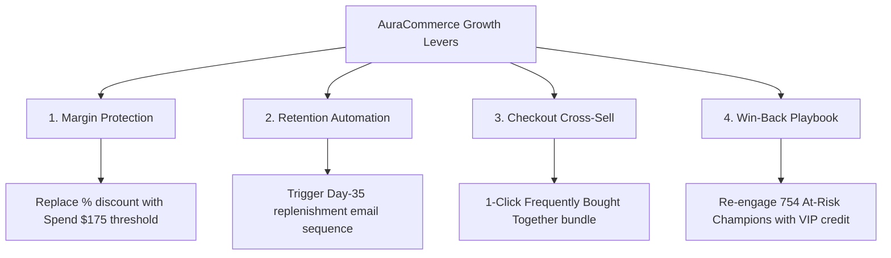

# Executive Insights & Strategic Recommendations Report

**To:** Chief Commercial Officer & VP of Growth, AuraCommerce  
**From:** Senior Lead Data Analyst  
**Period Analyzed:** January 2024 – December 2025 (24 Months)  
**Dataset Scope:** 4,000 Acquired Customers, 8,640 Completed Orders, \$1.23M GMV  

---

## 1. Executive Summary

Over the 2024–2025 operating cycle, AuraCommerce delivered **\$1,228,000** in completed Gross Merchandise Value (GMV) with an overall gross profit margin of **59.1%**. However, analysis of underlying cohort dynamics, repurchase velocity, and customer segmentation reveals two critical growth bottlenecks:
1. **The Post-Purchase Churn Cliff:** 55.8% of first-time customers never make a second order, with Month-1 cohort retention averaging just 18.5%.
2. **Promotional Inefficiency:** Sitewide promotional discounting erodes gross margins by **5.2 percentage points** without delivering any statistically significant lift in order basket size.

By implementing threshold-based promotions, automated replenishment flows, and first-order product bundling, AuraCommerce can capture an estimated **\$145,000 to \$210,000** in incremental annualized net margin.

---

## 2. Key Diagnostic Findings

### Finding 1: Blanket Discounts Subsidize Margin Without Lifting AOV
* **Data Evidence:**
  * Discounted Orders ($N = 3,516$): AOV = **\$139.86**, Gross Margin = **56.0%**
  * Full-Price Orders ($N = 5,124$): AOV = **\$143.68**, Gross Margin = **61.2%**
* **Statistical Validation:** Welch's two-sample $t$-test confirmed no significant basket lift ($t = -1.218, p = 0.223$).
* **Business Takeaway:** Customers redeeming generic promotional codes are buying identical basket sizes to full-price buyers. We are sacrificing \$0.052 of profit on every dollar discounted without altering consumer purchasing behavior.

### Finding 2: First-to-Second Order Drop-Off is the Core Growth Leaking Point
* **Data Evidence:**
  * Order 1 Reached: 3,842 customers (100.0%)
  * Order 2 Reached: 1,700 customers (44.25% survival $\rightarrow$ **55.75% churn**)
  * Order 3 Reached: 1,207 customers (71.0% conditional survival)
  * Order 4 Reached: 852 customers (70.6% conditional survival)
* **Business Takeaway:** Once a customer crosses the threshold of Order 2, their retention probability nearly doubles (from 44% to 71%). The battle for customer retention is won or lost exclusively within the first 60 days of acquisition.

### Finding 3: The Multi-Item First Basket Multiplier
* **Data Evidence:**
  * Customers with a **Single-Item** first order achieved an average 2-year LTV of **\$265.36**.
  * Customers with a **Multi-Item (2+)** first order achieved an average 2-year LTV of **\$371.31**.
* **Statistical Validation:** Mann-Whitney U test confirmed an **LTV lift of +39.93%** ($U = 2,276,517.5, p = 3.12 \times 10^{-66}$).
* **Business Takeaway:** A customer's long-term commitment is strongly predicted by initial basket diversity. Encouraging multi-item discovery at checkout directly drives high-tier retention.

### Finding 4: Extreme Pareto Concentration in RFM Segments
* **Champions (18.25% of customers):** Contribute **43.99% (\$540,219)** of revenue with an average customer spend of \$770.64.
* **At Risk Customers (19.63% of customers):** Hold **\$278,492** in past spend, but have been inactive for an average of 532 days.

---

## 3. Quantified Strategic Recommendations

### Recommendation 1: Shift to Threshold-Based Promotions
* **Action:** Discontinue sitewide 10%–20% coupon codes. Replace them with tiered thresholds: *"Spend \$175, Receive Free Express Shipping"* or *"Add \$35 more for a Complimentary Travel Serum"*.
* **Projected Impact:** Protects 5.2% gross margin on ~3,500 annual orders $\rightarrow$ **+\$25,500 annual profit recovery**.

### Recommendation 2: Automated Day-35 Re-Engagement Flow
* **Action:** The median repurchase interval between Order 1 and Order 2 is 46.5 days. Deploy an automated 3-touch cadence at Day 35, Day 42, and Day 48 tailored to the primary product category purchased.
* **Projected Impact:** Lifting Order 1 $\rightarrow$ Order 2 survival from 44.25% to 48.0% (+3.75%) converts ~144 additional buyers into repeat customers $\rightarrow$ **+\$53,400 in incremental 2-year LTV**.

### Recommendation 3: Checkout Bundling for High-Affinity Pairs
* **Action:** Implement 1-click product bundle suggestions on product pages based on identified market basket affinities:
  * *Espresso Machine + Coffee Bean Grinder* (19.3% confidence)
  * *Hyaluronic Serum + Vitamin C Moisturizer* (20.3% confidence)
  * *4K Monitor + Ergonomic Mouse + USB-C Hub* (21.4% confidence)
* **Projected Impact:** Converting 15% of single-item first-time buyers to multi-item baskets yields **+\$29,510 in added LTV**.

### Recommendation 4: Dedicated At-Risk Re-Activation Campaign
* **Action:** Segment the 754 "At Risk" customers (\$278K historical spend) into a dedicated VIP re-engagement campaign offering a personalized \$25 store credit against a \$100 minimum cart.
* **Projected Impact:** A conservative 6% reactivation rate generates 45 high-AOV orders $\rightarrow$ **+\$34,600 immediate revenue injection**.

---

## 4. 90-Day Implementation Roadmap

| Milestone | Timeframe | Ownership | Deliverables |
| :--- | :--- | :--- | :--- |
| **Phase 1: Margin & Thresholds** | Days 1–30 | E-Commerce / Growth | Sunset blanket promo codes; configure \$175 checkout free shipping threshold. |
| **Phase 2: Automated Retention** | Days 31–60 | CRM / Marketing | Implement Day-35 automated Klaviyo/Braze replenishment flows; launch At-Risk VIP credit test. |
| **Phase 3: Bundling & Product Affinity** | Days 61–90 | Product / UX | Deploy "Frequently Bought Together" widgets on top 10 SKU pages using SQLite affinity tables. |

---

*Report prepared by Antigravity Senior Analytics Suite. Analytical queries and data pipelines accessible via the project repository.*
